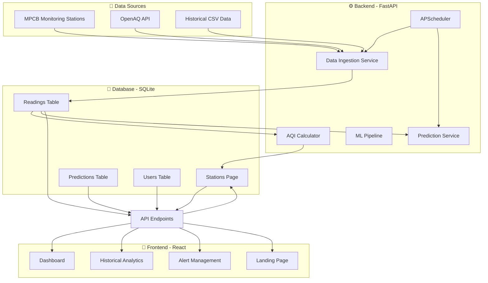
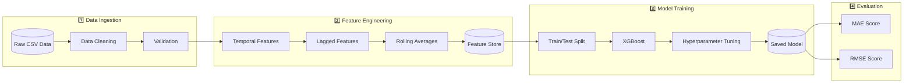
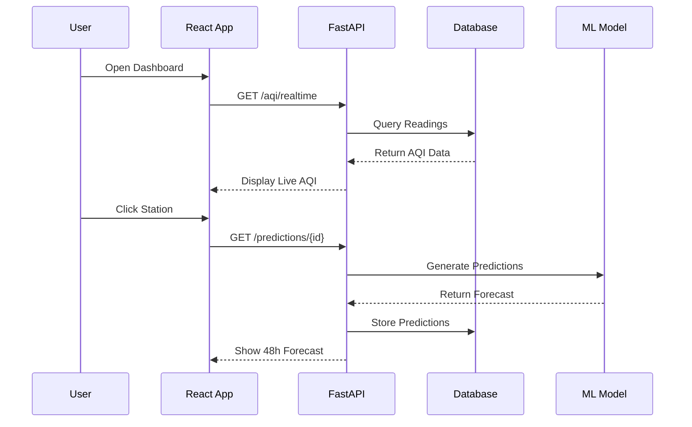

# AirWatch Pro - System Architecture

> **Note**: These diagrams are best viewed in:
> - VS Code with Mermaid Preview extension
> - [Mermaid Live Editor](https://mermaid.live)
> - GitHub with Mermaid plugin

---

## 📊 System Architecture



---

## 🤖 Model Training Pipeline



---

## 🔮 Prediction Flow



---

## 📈 AQI Calculation Flow

```mermaid
flowchart TB
    subgraph Input["Raw Pollutants"]
        PM25[PM2.5]
        PM10[PM10]
        NO2[NO2]
        SO2[SO2]
        O3[O3]
        CO[CO]
    end

    subgraph Conversion["Unit Conversion"]
        CONV[Convert to ug/m3]
    end

    subgraph SubIndex["Sub-Index Calculation"]
        SI[Calculate Sub-Indices]
    end

    subgraph Final["Final AQI"]
        MAX[Max(Sub-Indices)]
        CAT[AQI Category]
    end

    PM25 --> CONV
    PM10 --> CONV
    NO2 --> CONV
    SO2 --> CONV
    O3 --> CONV
    CO --> CONV
    CONV --> SI --> MAX --> CAT
```

---

## 📁 Related Files

- [README.md](../README.md) - Main project documentation
- fastapi_app/app/services/ml_pipeline.py - ML pipeline code
- fastapi_app/app/services/prediction_service.py - Prediction service
